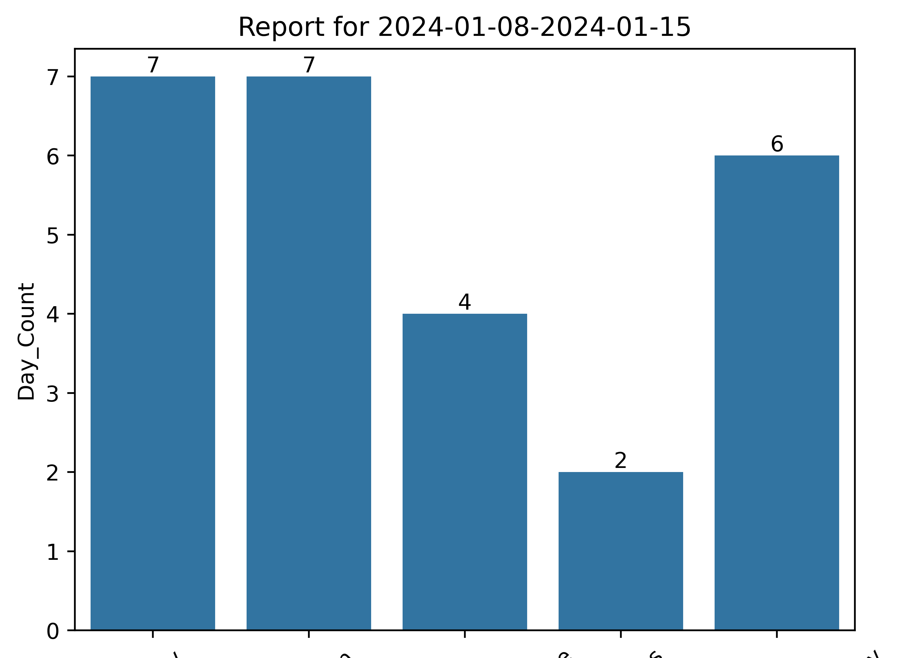
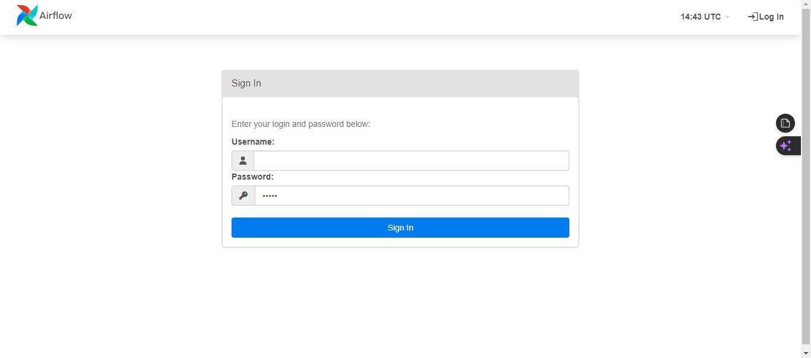

## Prayer/Work Status Report Using Airflow.

### Introduction
As an upcoming Data Engineer, I had been trying to upskill myself by learning the relevant tools required so I did some research and decided to pick up Airflow. While learning,
I started thinking of a practical task to give myself and then I thought about tracking my prayer and work status with Airflow. A task which I had planned to do with locker studio.

This repo contains how I was able to setup and run Airflow locally using both python (which was difficult to do) and Docker.

### Brief Introduction to the Basics of Airflow
Apache Airflow is a workflow Orchestration tool. In simpler terms, it's a tool used to order tasks in a way we want to execute them. I'll use this project as an example, breaking it down 
into steps;
1. I connected to Google sheets, did some data cleaning and got my dataset in a particular order, did some aggregation and the report plot was created.
2. I then sent the generated plot to myself via email.
3. These are two different tasks I wanted to achieve and this was what Airflow helped me do. 

Going deeper, I could also schedule this such that every Sunday or whenever, Aiflow will
automatically trigger this Directed Acyclic Graph (DAG) as it's popularly called and I'll get the plots automatically. These are some of the strengths of Airflow.

Aiflow consists of three main components;
- The Airflow scheduler: Parses DAGs, checks their schedule interval, and (if the DAGs’ schedule has passed) starts scheduling the DAGs’ tasks for execution by
passing them to the Airflow workers.
- The Airflow workers: Pick up tasks that are scheduled for execution and execute them. As such, the workers are responsible for actually “doing the work”
- The Airflow webserver: Visualizes the DAGs parsed by the scheduler and provides the main interface for users to monitor DAG runs and their results

### Setting up Airflow using Python
I had tried to `pip install apache-airflow` but after installation, and running `airflow webserver`, there was a dependency error "[pwd module is not available for windows](https://github.com/apache/airflow/discussions/24323)". 
So, I had to use [kali linux subsystem on windows via WSL](https://medium.com/@tristian_56632/installing-apache-airflow-on-windows-usng-wsl-771e803762c9). The link before this sentence contains detailed
steps in running Airflow after the linux app has been installed. My steps are also listed below to give you that personal feeling.

#### Steps 
1. I already had kali linux installed with the WSL2 setup, to do this I strongly recommend this [Video](https://youtu.be/27Wn921q_BQ?si=K9ok76XhhuOrSnrG)
2. Search `kali-linux` or which ever you installed and launch a window.
3. Run `sudo apt update` to update the package lists to ensure you have the latest information about available packages
4. Run `sudo apt install -y python3.11 python3.11-dev python3-pip python3-venv` to install python 3.11
5. Create a virtual environment `python3 -m venv Airflow_Learning`
6. Activate your virtual environment `source Airflow_Learning/bin/activate`
7. Initialize airflow db file `airflow db init`
8. Create a user which you'll need to login when you get to the webserver `airflow users create --username admin --password admin --firstname Chigozie --lastname Udoh --role Admin --email iamadataengineer@gmail.com`

9. Create a dag directory in the airflow dir cd `/home/pithun/airflow` -> 
`mkdir dags`
10. Copy DAG files from your local to airflow dir. In the Kali-Linux window, my local drive path was in `mnt/Users/User`. Then I copied using cp "mnt/Users/User/DAGs/." "/home/pithun/airflow".
11. Install the necessary modules required by your DAG e.g `pip install seaborn`
12. Start the webserver with an optionally defined port `airflow webserver -p 8877`
13. In a seperate kali window start the airflow scheduler `airflow scheduler`
14. You're good to go!!
15. Subsequently after you open the linux window, you only have to change to the virtual environment using `source Airflow_Learning/bin/activate` and then,
you can run the airflow webserver and aiflow scheduler as above.

### Setting up Airflow using Docker
This is usually the recommended option for actual production as we usually don't run all the components on a single host and using containers resembles using different hosts.

#### Steps
1. Start your Docker Engine
2. In powershell you can run `docker pull apache/airflow` to download the image
3. Create `Dockerfile`, sample is present in `Docker-Files` dir in this repo to rebuild the image with the relevant python modules installed via the `requirements.txt` file also in `Docker-Files` dir
4. Run `docker build -t new-image-name .` in the directory where the `Dockerfile` is in your system via powershell. You can navigate there using `cd`
5. Input the necessary configurations into the `docker-compose.yml`, sample is present in `Docker-Files` dir in this repo with the
`image` variable taking the `new-image-name`
6. Run `docker-compose up` after navigating to `docker-compose.yml` file dir to execute it
7. To stop the container, you can manually pause it in docker app
8. As an extra, in your powershell, you can use `docker exec -it container_name /bin/bash` to get into the container. The container name can be found in the docker app
